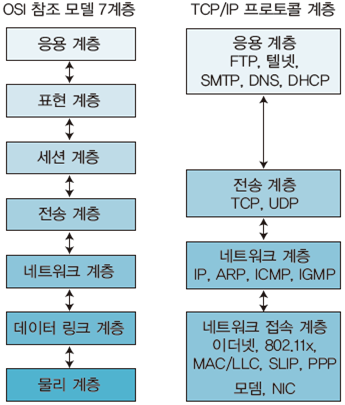
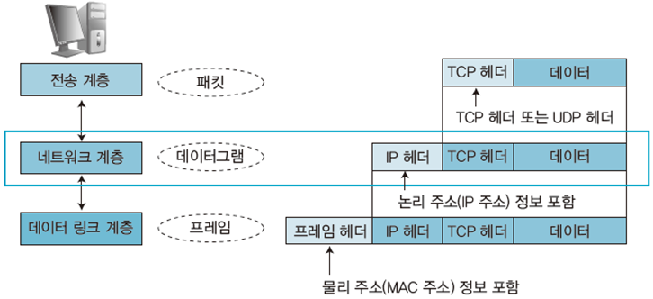
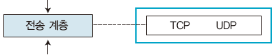
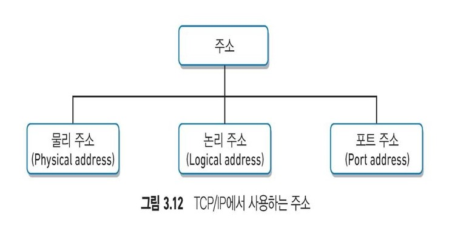
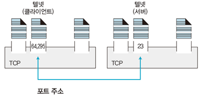
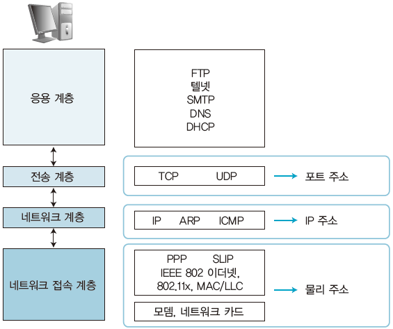

# TCP/IP의 이해

1. TCP/IP 프로토콜 구조
2. TCP/IP 주소의 구조

 

- 인터넷에서 컴퓨터 간의 통신이 가능하도록 표준화하여 채택한 통신규약
- **TCP/IP**는 인터넷의 두 호스트 간에 데이터 흐름의 정확성을 보장하는 프로토콜
  - **TCP**: 데이터의 흐름을 제어하거나 데이터가 정확한지 검사
  - **IP**: 데이터 패킷을 전송

 

> 인터넷에 연결된 컴퓨터들을 **호스트**라고 하는데, 이 호스트로 전송되는 데이터는 **패킷**이라는 작은 단위로 **분할**하여 전송한다.

  

## 1. TCP/IP 프로토콜 구조

TCP/IP 프로토콜 계층
1. 네트워크 접속 계층
2. 네트워크 계층
3. 전송 계층
4. 응용 계층

 

특정 계층에서 수행되는 **프로토콜의 사용자**는 상위 계층에서 수행되는 **프로세스**가 된다.

- 인터넷 계층(IP계층)에서 실행되는 프로토콜은 전송 계층에서 실행되는 프로세스
- 전송 계층에서 실행되는 프로토콜은 응용 계층에서 실행되는 프로세스
- 응용 계층에서 실행되는 프로토콜은 사용자나 응용 프로그램

 

  

### 1. 네트워크 접속 계층(Physical Layer & Data Link Layer)

> 하드웨어적인 요소와 관련된 모든 것을 지원하는 계층

- 송신 호스트  
상위 계층에서 전달받은 패킷에 **물리적 주소인 MAC 주소 정보가 있는 헤더를 추가**하여 프레임을 만든 후 그 프레임을 하위 계층인 물리 계층에 전달
  
- 수신 호스트  
데이터 링크 계층에서 추가된 헤더를 제거하여 상위 계층인 네트워크 계층으로 전달한다. 이때 **프레임의 크기**는 **네트워크 토폴로지**가 결정한다.

  

### 2. 네트워크 계층(인터넷 계층)
- 패킷 전송
- 데이터 전송 경로 선택
- 네트워크 주소 체계 관리
- 데이터그램을 정의
- 종류: IP, ARP, ICMP, IGMP 

 

 

#### 네트워크 계층의 역할
데이터그램을 정확한 수신지로 전송하는 것 

##### 데이터그램
- IP 프로토콜에서 다루는 패킷 데이터
- 송신지 주소와 수신지 주소, 보내는 데이터와 몇 가지 제어 필드 등

##### 과정
- 송신 호스트  
상위 계층에서 전달받은 패킷에 논리적 주소인 **IP주소를 포함하는 헤더를 추가**하여 하위 계층인 데이터 링크 계층으로 전달 

- 수신 호스트  
하위 계층에서 전달받은 패킷의 헤더 정보를 확인한 후 송신 측 컴퓨터의 네트워크 계층에서 추가한 헤더를 제거하여 상위 계층인 전송 계층으로 전달

  

### 3. 전송 계층

 

 

- 상위 계층에서 볼 때 두 호스트 간의 데이터 전송을 담당하는 계층
- 시스템의 논리 주소(IP주소)와 포트가 있어 각 상위 계층의 프로세스를 연결하여 통신
- 프로토콜 종류: TCP, UDP

 

#### 전송 계층 역할
네트워크 양단의 송수신 호스트 간에 신뢰성 있는 전송 기능 제공

 

#### TCP
전송되는 패킷에 오류와 중복이 없게 하고, 보낸 순서대로 상대편이 받을 수 있도록 신뢰성 있는 데이터 전송을 보장하는 프로토콜이다. 신뢰성이 있는 만큼 헤더의 오류코드에 대응할 수 있는 각종 정보가 들어 있다.

전송되지 않은 패킷이 있으면 해당 패킷을 **재전송**하기 때문에 원본 데이터와 일치하는 데이터를 재결합할 수있다. 또한 전송된 패킷의 도착 순서가 바뀌어도 **패킷의 일련번호**를 이용하여 원본과 일치하는 데이터를 재결합할 수 있다. 

#### UDP
전송되지 않은 패킷이 있어도 이를 무시하고 패킷이 도착하는 순서대로 데이터를 재결합한다. 따라서 원본과 일치하는 데이터의 재결합을 보장하지 않는다. 하지만 데이터의 정확한 전송보다는 빠른 전송이 필요한 멀티미디어 통신에서는 UDP가 TCP보다 더 유용 할 수 있다. 

 

#### 전송 계층 과정
- 송신 측 컴퓨터  
  - 상위 계층에서 전달받은 데이터를 효율적으로 전송하려고 **패킷 단위로 분할**한다.
  - 패킷을 생성할 때 TCP를 이용하면 해당 패킷에는 TCP 헤더 정보가 포함되고, UDP를 이용하면 해당 패킷에는 UDP 헤더 정보가 포함된다.

- 수신 측 컴퓨터  
  - 하위 계층에서 전달받은 패킷을 **원래의 데이터로 재결합**한다. 
  - 전송받은 패킷이 TCP를 이용하여 만든 패킷인지, 아니면 UDP를 이용하여 만든 패킷인지 패킷의 헤더 정보로 알아낸다. TCP 패킷이면 TCP 프로토콜을 사용하여 재결합하고, UDP 패킷이면 UDP 프로토콜을 사용하여 재결합한다.

  

### 4. 응용 계층(Application Layer)
TCP/IP 프로토콜을 이용한 응용 프로그램을 응용계층으로 분류

- 클라이언트/서버 시스템
  - 서버 데몬  
  - 클라이언트 

  

## 2. TCP/IP 주소의 구조

 

 

- 물리 주소
- 인터넷 주소
- 포트 주소

 

### 물리 주소
물리주소(MAC 주소)는 링크 주소 또는 통신망에서 정의된 노드의 주소, 이더넷 네트워크 인터페이스 카드(NIC) 6바이트(48비트) 주소 등을 말한다. 

MAC 주소는 이더넷에서 각 호스트를 구별하려고 모든 이더넷 카드에 개별적으로 부여하는 고유한 식별 번호를 말한다. MAC 주소는 회사에서 제품을 제작할 때 할당 받으므로 임의로 지정할 수 없다. 

물리 주소는 데이터 링크 계층의 논리적 구성 단위인 프레임에서 사용하는데, 이것은 최하위 계층의 주소다. 이더넷은 6바이트(48비트) 물리 주소를 사용하며, FDDI나 토큰링처럼 다른 주소 형태를 사용하는 것도 있다.

 

### 인터넷 주소

인터넷에서는 기존 물리 주소와는 별도로 각 호스트를 식별할 수 있는 유일한 주소를 지정해야 한다. 인터넷 주소는 현재 인터넷에 연결된 호스트를 유일하게 식별할 수 있는 32비트 주소(IPv4) 체계를 사용하는데, 주민등록번호나 학번처럼 인터넷의 두 호스트는 동일한 IP 주소를 중복해서 사용할 수 없다.

 

### 포트 주소
- 프로세스 식별 주소
- TCP/IP 포트 주소의 길이는 16비트
- TCP 메시지의 헤더에 송수신 포트 번호의 정보가 들어 있다.
- 포트 번호는 접근하려는 서비스를 말한다.  
- 보통 클라이언트는 랜덤 포트를 할당 받고, 서버는 고정된 포트를 사용한다.
  
 

 

인터넷에 흩어져 있는 호스트와 통신하려면 해당 호스트에 접속하는 IP 주소와 함께 이용하려는 서비스에 접근하는 해당 포트 번호도 알아야 한다. 

- 전화번호: **IP**  
- 거는/받는 사람: **Port**

 

