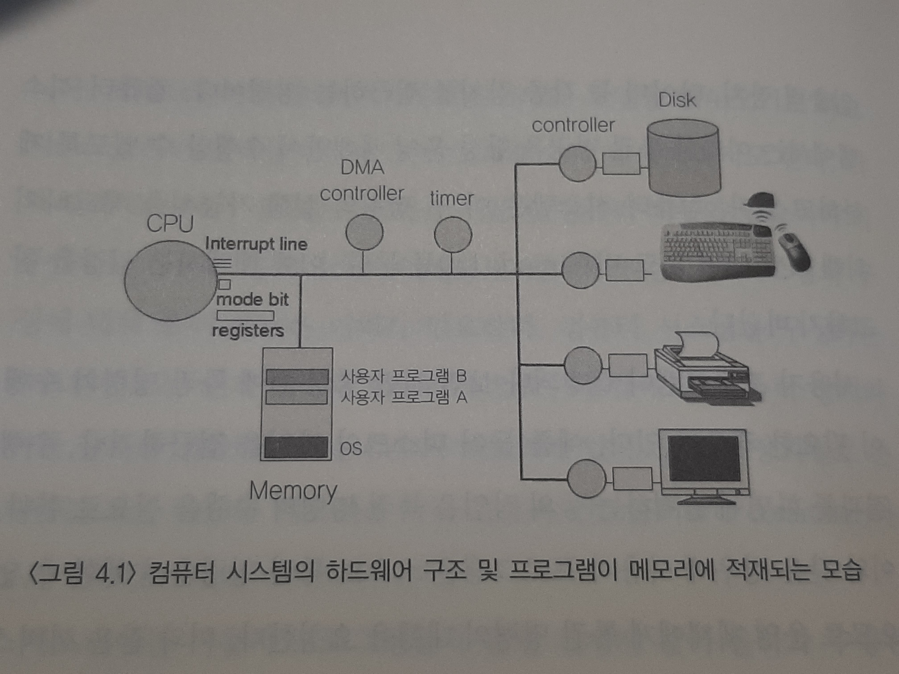
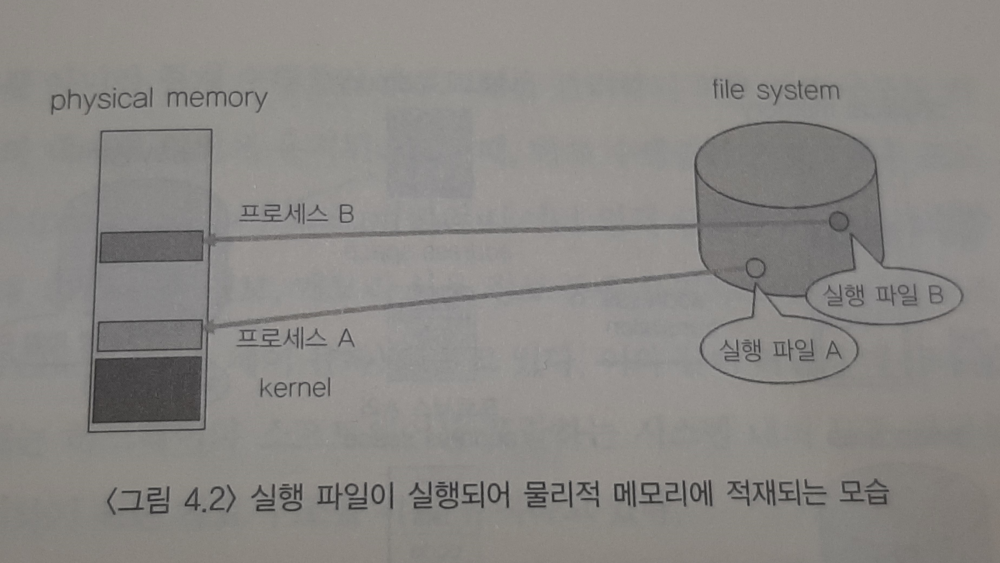
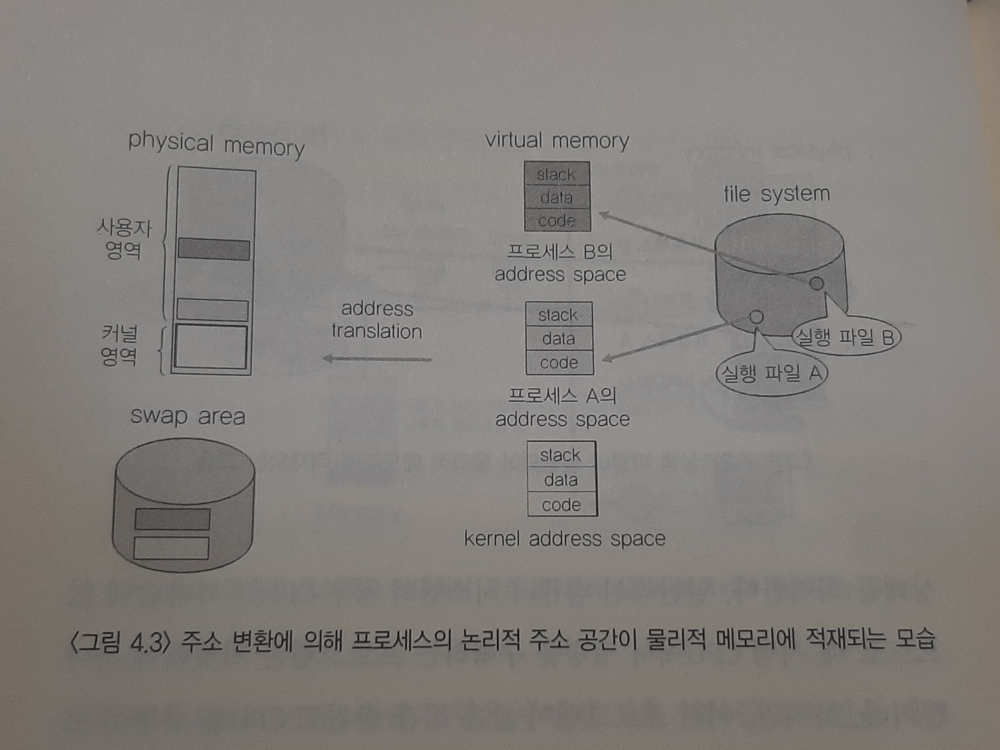
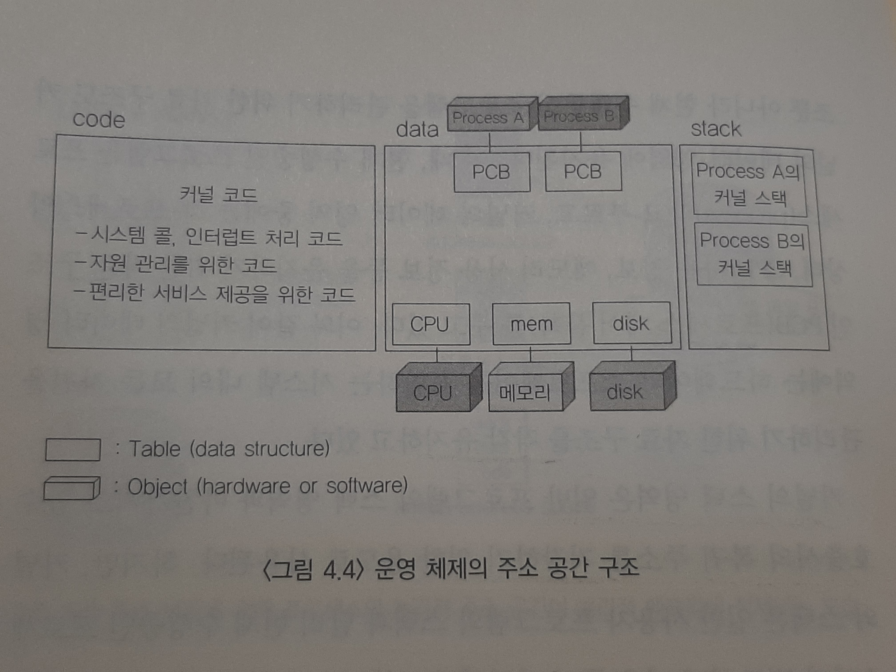
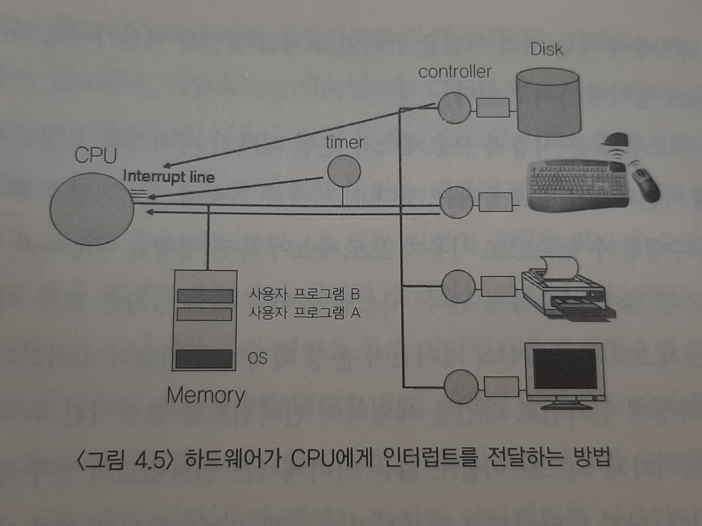
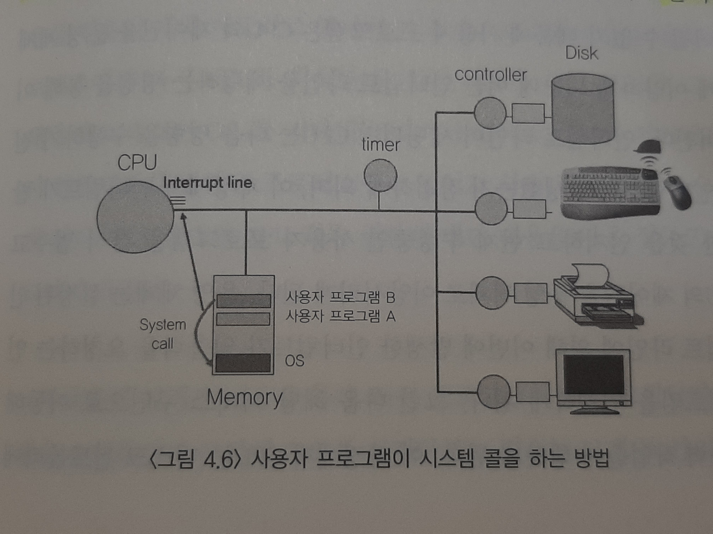
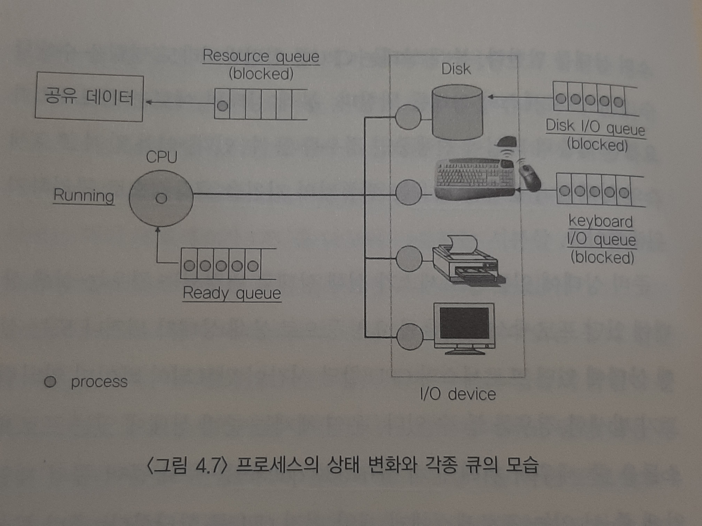
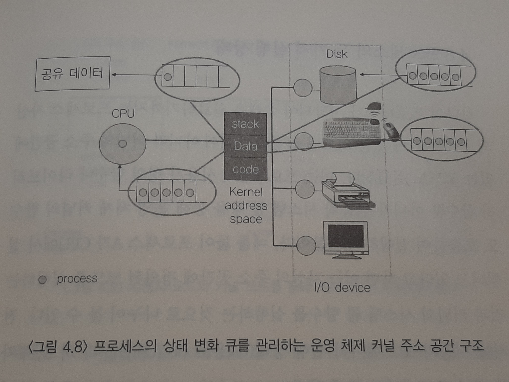
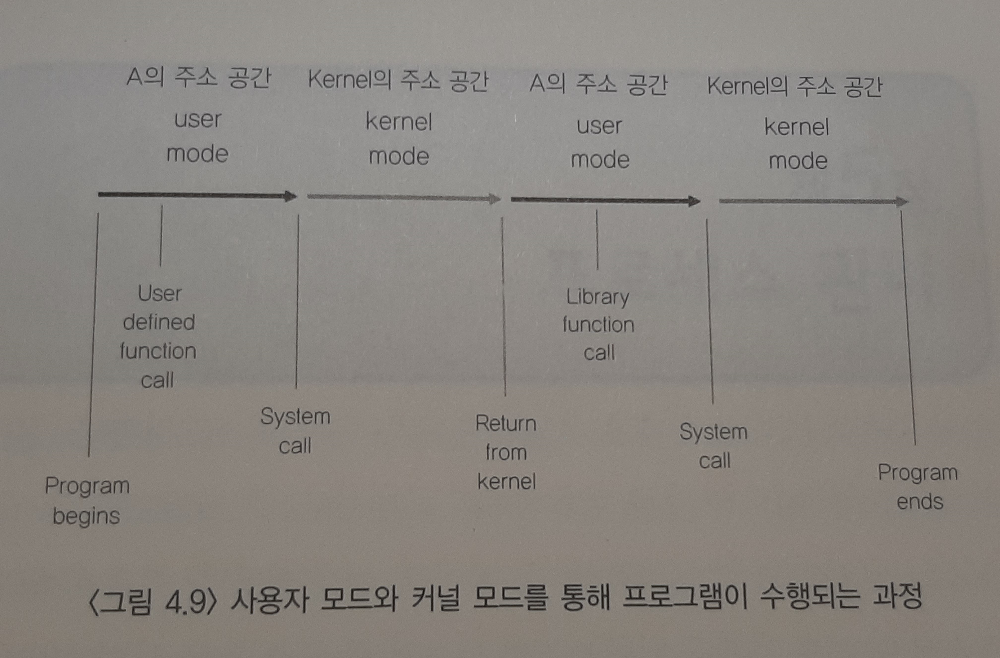

# 인터럽트의 원리

- [인터럽트의 원리](#인터럽트의-원리)
  - [1. 프로그램의 구조와 인터럽트](#1-프로그램의-구조와-인터럽트)
  - [2. 컴퓨터 시스템의 작동 개요](#2-컴퓨터-시스템의-작동-개요)
  - [3. 프로그램의 실행](#3-프로그램의-실행)
  - [4. 사용자 프로그램이 사용하는 함수](#4-사용자-프로그램이-사용하는-함수)
  - [5. 인터럽트](#5-인터럽트)
  - [6. 시스템 콜](#6-시스템-콜)
  - [7. 프로세스의 상태](#7-프로세스의-상태)
  - [8. 프로세스의 두 가지 실행 상태](#8-프로세스의-두-가지-실행-상태)

  

## 1. 프로그램의 구조와 인터럽트

우리가 사용하는 컴퓨터 프로그램은 어떠한 프로그래밍 언어로 작성되었든 그 내부적인 구조는 함수들로 구성된다. 하나의 함수가 수행되는 중에 다른 함수를 호출하고, 호출된 함수의 수행이 끝마쳐지면 다시 원래 호출했던 함수의 위치로 되돌아가 프로그램을 계속 수행하게 된다.

한편, 프로그램이 CPU에서 명령을 수행하려면 수행하려는 주소 영역이 메모리에 올라가 있어야 한다. 이 때 프로그램의 주소 영역은 크게 코드, 데이터, 스택 영역으로 구분된다. 코드 영역은 우리가 작성한 프로그램 함수들의 코드가 기계어 명령(machine instruction)으로 변환되어 저장되는 부분이다. 데이터 영역은 전역 변수 등 프로그램이 사용하는 데이터를 저장하는 부분이다. 스택 영역은 함수가 호출될 때 호출된 함수의 수행을 마치고 복귀할 주소 및 데이터를 임시로 저장하는데 사용되는 공간이다.

우리가 작성한 프로그램은 제일 처음 메인 함수에서 실행을 시작해 메인 함수가 다른 함수를 호출하면 CPU가 메인 함수의 코드를 수행하다가 다른 함수의 코드로 수행 위치를 이동하게 한다. 그러면 프로그 램은 새로운 함수 위치로 점프해 그 함수를 실행하고 함수 수행이 완료 된 후에는 원래 호출했던 함수 위치로 돌아오게 된다. 이 때 다시 돌아와야 하는 지점을 스택에 저장하게 되는 것이다. 

예를 들어 X라는 함수가 수행 중에 Y라는 함수를 호출한 경우를 생각해 보자. 프로그램은 X 함수에서 Y 함수를 호출한 지점을 스택에 저장해 놓았다가 Y 함수가 수행된 후 스택에 저장된 주소 위치로 돌아와 코드를 계속 수행하게 되는 것이다.

인터럽트의 동작 원리도 함수의 호출과 비슷하다. A라는 프로그램이 CPU를 할당받고 명령을 수행하고 있는데 인터럽트가 발생하면 A는 현재 수행중인 명령의 위치를 저장해 놓는다. 그 후 운영 체제 내부 코드인 인터럽트 처리 루틴으로 넘어가서 인터럽트 처리를 하고 다시 돌아와 A의 이전 작업 지점부터 수행을 계속 이어가게 된다. 일반적으로 프로그램 내에서 발생되는 함수 호출에 필요한 복귀 주소는 각 프로그램의 주소 공간 중 스택 영역에 보관한다. 반면, 인터럽트 때문에 CPU를 선점당한 위치를 저장하기 위한 공간은 운영 체제 커널 부분에 존재하게 된다.

운영 체제는 현재 실행중인 모든 프로그램을 관리하기 위한 자료 구조를 유지하고 있다. 예를 들어 A와 B 두 개의 프로그램이 현재 수행중이라면 커널 어딘가에 이 두 프로그램을 관리하기 위한 자료 구조가 존재한다. 이 자료 구조를 프로세스 제어 블록(PCB: Process Control Block)이라고 부른다. 프로세스 제어 블록에는 인터럽트가 발생했을 때 그 프로그램의 어느 부분까지 수행했는지를 저장하기 위한 영역이 존재한다. 프로그램 A가 수행중에 인터럽트가 발생하면 현재 실행중인 지점을 A의 프로세스 제어 블록에 저장한 후, 인터럽트 처리 루틴으로 가서 인터럽트 발생과 관련된 일 처리를 한다. 인터럽트 처리를 모두 마치면 프로그램 A의 프로세스 제어 블록에 저장된 주소를 복원 시켜 원래 수행하던 일을 재개하게 된다.

  

## 2. 컴퓨터 시스템의 작동 개요

CPU는 인간의 뇌처럼 스스로 생각하고 판단하는 능력을 갖추고 있지는 못하다. 이는 CPU가 빠른 속도로 처리하는 계산 능력은 가지고 있지만, 어떠한 작업을 수행 해야 하는지에 대해 스스로 결정하는 능력은 갖추지 못했기 때문이다. CPU는 현재 수행해야 할 메모리 주소의 명령을 있는 그대로 처리할 뿐이다. 이 때, CPU가 수행해야 할 메모리 주소를 담고 있는 레지스터를 프로그램 카운터라고 부른다. 즉, CPU는 매번 프로그램 카운터가 가리키는 메모리 영역의 명령을 처리하게 된다. 일반적으로 조건문이나 반복문, 함수 호출 등에 의한 주소 이동이 없는 이상 프로그램 카운터는 항상 바로 다음 주소의 명령을 가리키게 되어 코드의 순차적인 수행이 이루어진다.

한편, 컴퓨터 시스템의 동작이 CPU에 의해서만 이루어지는 것은 아니다. 프로그램이 수행되는 중에 디스크에서 파일을 읽어오기도 하고 키보드로부터 입력을 받거나 처리 결과를 화면에 출력하기도 한다. 이 와 같이 CPU에서 명령을 수행하는 부분과, 컴퓨터 외부와 입출력이 이루어지는 부분을 총체적으로 이해하기 위해서는 컴퓨터 시스템의 구성에 대해 좀더 폭넓은 이해가 필요하다. 컴퓨터 시스템을 구성하는 하드웨어로는 먼저 CPU와 메모리가 있고, 이 밖에 각 입출력 장치와 이들 장치를 전담하는 작은 CPU와 메모리가 있다. 입출력 장치별로 존재하는 작은 CPU와 메모리를 각각 입출력 컨트롤러(I/O controller)와 로컬 버퍼(local buffer)라고 부른다.

메모리에는 사용자 프로그램들과 운영 체제가 같이 올라가 수행된다. 이 때 CPU는 프로그램 카운터가 가리키는 메모리 위치의 프로그램을 수행하게 된다. 예를 들어 프로그램 카운터가 메모리 주소 중 운영 체제가 존재하는 부분을 가리키고 있다면, 현재 운영 체제의 코드를 수행중이며, 이 경우 CPU가 커널 모드(kernel mode)에서 수행중이라고 이야기한다. 반대로 프로그램 카운터가 사용자 프로그램이 존재하는 메모리 위치를 가리킬 경우 그 메모리 위치에 올라가 있는 사용자 프로그램이 수행중이며, 이 경우 사용자 모드(user mode)에서 CPU가 수행되고 있다고 이야기한다. 통상적으로 명령들은 순차적으로 수행되나, 함수 호출 등으로 점프해 바로 다음 주소가 아닌 명령을 수행할 수도 있다.

CPU가 수행하는 명령에는 일반 명령과 특권 명령이 있다. 일반 명령은 메모리에서 자료를 읽어와서 CPU에서 계산하고 결과를 메모리에 쓰는 일련의 명령들을 말한다. 이러한 일반 명령은 모든 프로그램이 수행할 수 있는 명령이다. 

반면 특권 명령은 보안이 필요한 명령으로 입출력 장치, 타이머 등 각종 장치를 접근하는 명령이다. 컴퓨터 시스템에서는 이러한 특권 명령을 항상 운영 체제만이 수행할 수 있도록 제한하고 있다. 컴퓨터 시스템은 이 두 명령의 실행 가능성을 체크하기 위해 CPU 내에 모드 비트(mode bit)를 둔다. 

사용자 프로그램이 실행되다 보면 일반 명령 외에 특권 명령의 수행이 필요한 경우가 있다. 예를 들어 디스크의 파일을 접근하거나, 수행 결과를 화면에 출력하는 등의 작업은 특권 명령의 수행을 필요로 한다. 이와 같은 경우에 사용자 프로그램은 스스로 특권 명령을 수행할 수 없으므로 운영 체제에게 특권 명령의 대행을 요청한다. 이와 같은 서비스 요청을 시스템 콜(system call)이라고 부른다. 사용자 프로그램이 시스템 콜을 하게 되면 운영 체제는 사용자 프로그램의 코드가 아닌 자신의 커널 영역에 정의된 시스템 콜 처리 코드를 수행하게 된다. 디스크에서 자료를 읽어오는 시스템 콜이라면, CPU가 컨트롤 레지스터를 세팅해 디스크 컨트롤러에게 데이터를 읽어오라는 명령을 내린다. 그러면 디스크 컨트롤러는 디스크로부터 데이터를 읽어와서 자신의 로컬 버퍼에 저장하게 된다. 이 작업이 완료되면 디스크 컨트롤러가 CPU에게 인터럽트를 발생시켜 입출력 작업이 완료되었음을 통지한다.

프로그램이 아닌 주변 장치가 CPU에게 서비스를 요청할 때에도 시스템 콜과 비슷한 방식을 사용한다. CPU는 프로그램 카운터가 가리키는 메모리 위치의 명령만 계속 수행하고 있기 때문에 주변 장치의 상태를 지속적으로 파악할 수 없다. 따라서, 주변 장치는 CPU의 도움이 필요한 경우 인터럽트를 사용해 CPU에게 서비스를 요청하게 된다. 인터럽트를 발생시키기 위해 주변 장치는 인터럽트 라인(interrupt line)을 세팅하게 되고 CPU는 매번 명령을 수행한 직후 인터럽트 라인을 체크해 서비스 요청이 들어왔는지를 체크하게 된다. 인터럽트에는 다양한 종류가 있기 때문에 각각의 인터럽트 발생 원인마다 라인을 다르게 해서 구분하게 된다. 인터럽트가 발생하면 CPU는 해당 인터럽트를 처리하기 위한 루틴으로 넘어가서 커널 내의 인터럽트 처리 코드를 수행하게 된다.

  

## 3. 프로그램의 실행

"프로그램이 실행 (program execution)되고 있다"는 것은 컴퓨터 시스템 차원에서 볼 때 크게 두 가지 중요한 의미를 가진다. 그 첫째는 디스크에 존재하던 실행 파일이 메모리에 적재됨을 의미한다. 두 번째는 프로그램이 CPU를 할당받고 기계 명령(instruction)을 수행하고 있는 상태를 의미한다. 일반적인 컴퓨터 시스템의 경우 CPU는 하나밖에 없으므로 매 시점 CPU에서 명령을 수행하는 프로그램은 기껏해야 하나 뿐이다. 하지만, 여러 프로그램이 짧은 시간 단위로 CPU를 나누어 쓰고, 이들 프로그램이 메모리에 동시에 적재되어 있을 수 있으므로 여러 프로그램이 동시에 실행된다는 말을 보편적으로 사용하는 것이다.

실행 파일이 메모리에 적재될 때에 실행 파일 전체가 메모리에 한꺼 번에 올라가기보다는 일부분만 메모리에 올라가고 나머지는 디스크의 특정 영역에 내려가 있는 것이 일반적이다. 이는 여러 프로그램이 공 유해서 사용하는 메모리 공간을 좀더 효율적으로 사용하기 위한 방법 이다. 구체적으로 살펴보면, 프로그램의 주소 공간 중 당장 CPU의 수행에 필요한 부분은 메모리에 올려놓고 그렇지 않은 부분은 디스크 중 메모리의 연장 공간으로 사용되는 스왑 영역에 내려놓는 방식으로 운영된다.

프로세스의 주소 공간은 앞서 설명한대로 코드(code), 데이터(data), 스택(stack) 등으로 구성된다. 각각의 프로그램마다 이러한 주소 공간을 별도로 가지며, 각 프로그램마다 독자적으로 존재하는 이와 같은 주소 공간을 우리는 가상 메모리(virtual memory) 또는 논리적 메모리 (logical memory)라고 부른다. 이는 실제 물리적 메모리의 주소와 독립적으로 각 프로그램마다 독자적인 주소 공간을 가지기 때문에 지칭하는 용어이다.

운영 체제도 하나의 프로그램이므로 운영 체제 커널 역시 코드, 데이터, 스택의 주소 공간 구성을 가지고 있다. 운영 체제의 기능이 그 아랫단의 하드웨어 자원을 효율적으로 관리하는 일과 윗단의 응용 프로그램 및 사용자에게 편리한 서비스를 제공하는 것이므로 커널의 코드는 CPU 메모리 등의 자원을 관리하기 위한 부분과 사용자에게 편리한 인터페이스를 제공하기 위한 부분이 주를 이루고 있다. 이 밖에도 커널의 코드는 시스템 콜 및 인터럽트를 처리하기 위한 부분을 포함한다.

커널의 데이터 영역에는 각종 자원을 관리하기 위한 자료 구조가 저장된다. CPU나 메모리와 같은 하드웨어 자원을 관리하기 위한 자료구조뿐 아니라 현재 수행중인 프로그램을 관리하기 위한 자료구조도 커 널의 데이터 영역에 유지된다. 이 때, 현재 수행중인 프로그램을 프로세스(process)라고 부르고, 커널의 데이터 영역 중에는 각 프로세스의 상태, CPU 사용 정보, 메모리 사용 정보 등을 유지하기 위한 자료구조인 PCB(프로세스 제어 블록)를 두고 있다. 이와 같이 커널의 데이터 영역에는 하드웨어와 소프트웨어를 포함하는 시스템 내의 모든 자원을 관리하기 위한 자료구조를 각각 유지하고 있다.

커널의 스택 영역은 일반 프로그램의 스택 영역과 마찬가지로 함수 호출시의 복귀 주소를 저장하기 위한 용도로 사용된다. 하지만, 커널의 스택은 일반 사용자 프로그램의 스택과 달리 현재 수행중인 프로세 스마다 별도의 스택을 두어 관리한다. 이는 프로세스가 함수를 호출할 때 자기 주소 영역 내부에 정의된 함수를 호출하면 자신의 스택에 복귀 주소를 저장하지만, 프로세스가 특권 명령을 수행하려고 커널에 정의된 시스템 콜을 호출하고 시스템 콜 내부에서 다른 함수를 호출하는 경우 그 복귀 주소는 커널 내의 주소가 되어 사용자 프로그램의 스택과는 별도의 저장 공간이 필요하기 때문이다. 또한, 커널은 일종의 공유 코드로서 모든 사용자 프로그램이 시스템 콜을 통해 커널의 함수를 접근 할 수 있으므로 일관성 유지를 위해 각 프로세스마다 커널 내에 별도의 스택을 두게 되는 것이다. 정리하자면, 프로그램이 실행되어 자기 자신의 코드 내에서 함수 호출 및 복귀 주소를 유지하기 위해서는 자기 주소 공간 내의 스택을 사용하고, 시스템 콜 등 커널 내의 함수를 호출 하는 경우에는 커널의 주소 공간에 존재하는 커널 스택을 사용하게 되는 것이다.

  

## 4. 사용자 프로그램이 사용하는 함수

프로그램이 사용하는 함수는 크게 사용자 정의 함수와 라이브러리 함수, 커널 함수의 세 가지로 구분해 볼 수 있다. 사용자 정의 함수란 프로그래머가 직접 작성한 함수를 뜻한다. 라이브러리 함수란 프로그 래머가 직접 작성하지는 않았지만 이미 누군가 작성해 놓은 함수를 호출만 하여 사용하는 경우를 뜻한다. 사용자 정의 함수와 라이브러리 함수는 모두 컴파일하여 실행 파일을 만들게 되면 그 프로그램의 코드 부분에 기계어 명령 형태로 삽입된다. 따라서, 이 두 함수는 프로그램이 실행될 때에 해당 프로세스의 주소 공간에 포함된다. 또한, 함수 호출시에도 자신의 주소 공간에 있는 스택을 사용하게 된다.

한편 커널 함수는 운영 체제 커널의 코드에 정의된 함수를 뜻한다. 커널 함수의 종류에는 사용자 프로그램이 운영 체제의 서비스를 요청하기 위해 호출하는 시스템 콜 함수와 각종 하드웨어 및 소프트웨어가 CPU의 서비스를 요청하기 위해 발생시키는 인터럽트 처리 함수가 있다. 이와 같은 커널 함수는 사용자 프로그램의 주소 공간에 그 코드가 존재하는 것이 아니라 운영 체제 커널의 주소 공간에 코드가 정의된 다. 즉, 운영 체제 내에 있는 함수를 사용자 프로그램이 호출해서 사용 하는 것이다. 예를 들어 삼각 함수인 sin( )은 라이브러리 함수이고, 화면에 문자열을 출력하는 printf( )는 그 자체로는 라이브러리 함수이지만 궁극적으로 특권 명령인 입출력을 수반하므로 printf() 내에서 커널 함수 호출인 시스템 콜을 동반하게 된다.

  

## 5. 인터럽트

이 책의 앞부분에서 컴퓨터 시스템의 동작 원리에 대해 설명하며 인터럽트의 개념을 간단히 살펴보았다. 여기에서는 인터럽트에 대해 좀 더 자세하게 알아보도록 하겠다. 인터럽트는 하드웨어 인터럽트와 소프트웨어 인터럽트로 나누어 볼 수 있으며, 일반적으로는 하드웨어 인터럽트를 의미한다. 즉, 하드웨어 컨트롤러가 CPU의 서비스를 요청하기 위해 발생시키는 인터럽트가 일반적인 의미의 인터럽트를 지칭하는 것이다. CPU는 특별한 일이 없으면 현재 수행중인 프로세스의 다음 명령을 순차적으로 수행한다. 프로세스가 CPU를 계속 점유하고 있으면 이를 다른 프로세스가 선점할 수 없으므로 이에 대한 제어 메커니즘이 필요하다. CPU는 프로그램 카운터가 가리키는 곳에 있는 명령을 수행하는 일밖에 하지 않기 때문에 현재 수행중인 프로세스로부터 CPU를 회수해 CPU가 다른 일을 수행하도록 하기 위해서는 인터럽트 메커니즘이 필요하다. 일반적으로 인터럽트는 CPU가 아닌 다른 하드웨어 장치가 CPU에게 어떤 사실을 알려 주거나 CPU의 서비스를 요청해야 할 경우 CPU 내에 있는 인터럽트 라인을 세팅해 발생시킨다. CPU는 매번 프로그램 카운터가 가리키고 있는 지점의 명령을 하나씩 수행하 고나서 다음 명령을 수행하기 직전에 인터럽트 라인이 세팅되었는지를 체크한다. 인터럽트 라인 체크를 통해 인터럽트가 발생했으면 CPU는 현재 수행하던 프로세스를 멈추고 운영 체제의 인터럽트 처리 루틴으로 이동해서 인터럽트 처리를 수행한다. 특정 프로세스가 CPU를 독점하는 것을 막기 위해 운영 체제는 타이머 인터럽트를 사용한다. 타이머는 우리가 사용하는 자명종과 유사하게 세팅된 시간이 되면 CPU에게 인터럽트를 발생시키는 하드웨어 장치이다. 운영 체제는 CPU를 사용자 프로세스에게 이양하기 직전에 타이머에 일정 시간을 세팅하게 되며, 사용자 프로세스가 그 시간만큼 CPU를 사용한 후에 발생하는 타이머 인터럽트 때에 CPU를 그 프로세스로부터 회수해 다른 프로세스에게 이양하게 되는 것이다.

한편, 넓은 의미의 인터럽트는 하드웨어 인터럽트와 트랩(trap)을 모두 포함하는 개념이다. 트랩이란 소프트웨어가 발생시키는 인터럽트를 말한다트랩의 종류에는 예외 상황(exception)과 시스템 콜(system call)의 두 종류가 있다예외 상황은 프로그램이 허용되지 않은 연산을 수행하려고 할 때 자동적으로 발생하는 것으로 운영 체제는 예외 상황이 발생했을 때 CPU의 제어권을 획득해 해당 상황에 대한 조치를 취하게 된다. 예외 상황의 예로는 0으로 나누는 연산(divide-by-zero), 자신의 주소 공간을 넘어서는 메모리 참조 등이 해당되며, 운영 체제는 예외 상황에 대한 처리 루틴을 인터럽트 처리 루틴과 마찬가지로 자신의 코드 영역에 가지고 있다.

시스템 콜은 사용자 프로세스가 운영 체제의 서비스를 요청하기 위해 커널의 함수를 호출하는 것이다. 사용자 프로세스가 직접 특권 명령을 수행할 수 없으므로 사용자 프로세스가 특권 명령을 수행하려 할 때 시스템 콜을 사용하게 된다. 시스템 콜이나 예외 상황은 모두 사용자 프로세스로부터 CPU의 제어권이 운영 체제에게 이양되어 처리되는데 이 과정에 인터럽트 라인을 세팅하여 인터럽트를 발생시킨 후 제어권이 넘어가게 되므로 이들도 넓은 의미에서는 인터럽트의 범주에 포함 시킨다. 단지 인터럽트를 발생시키는 주체가 하드웨어 장치가 아닌 소프트웨어이므로 이들을 소프트웨어 인터럽트라고 부르는 것이다.

인터럽트와 관련된 주요 용어에는 인터럽트 벡터(interrupt vector)와 인터럽트 핸들러(interrupt handler)가 있다. 인터럽트 벡터란 여러 가지 '인터럽트에 대해 해당 인터럽트 발생시 처리해야 할 루틴의 주소를 보관하고 있는 테이블을 의미한다. 이것은 일종의 함수를 가리키는 포인터(pointer)라고도 할 수 있다. 인터럽트 핸들러는 실제 인터럽트를 처리하기 위한 루틴으로 인터럽트 서비스 루틴이라고도 부른다. 운영 체제 코드 부분에는 각종 인터럽트별로 처리해야 할 내용이 이미 프로그램되어 있으며, 이 부분을 인터럽트 서비스 루틴 또는 인터럽트 핸들러 라고 부른다. 인터럽트의 처리를 마치고나면 인터럽트가 발생하기 직전의 프로세스에게 CPU의 제어권이 다시 넘어가게 된다. 다만, 타이머 인터럽트인 경우에는 CPU를 그 프로세스로부터 회수해 다른 프로세스에게 이양하기 위해 발생시킨 인터럽트이므로 인터럽트 처리가 끝난 뒤 CPU의 제어권을 직전에 작업하던 프로세스에게 다시 부여하지 않는다.

  

## 6. 시스템 콜

CPU는 매 시점 프로그램 카운터가 가리키고 있는 메모리 주소의 명 령을 수행한다. 프로그램 카운터가 프로세스 A의 주소 공간을 가리키 고 있다면 프로세스 A의 코드 부분이 실행되는 것이다. 한편, 컴퓨터 시스템에서는 하드웨어 및 소프트웨어 자원의 보안을 위해 CPU가 실 행할 수 있는 명령을 일반 명령과 특권 명령으로 나누어 관리한다. 예 를 들어 입출력 장치를 접근하는 명령은 특권 명령으로 규정해 디스크 에 있는 남의 파일을 보는 등 입출력 장치에 대한 자유로운 접근을 사 용자 프로세스가 직접 하지 못하도록 제한하고 있다.

이러한 관리를 하드웨어적으로 지원하기 위해 모드 비트(mode bit) 를 두고 있다. 모드 비트가 0으로 세팅된 경우를 커널 모드(또는 시스 템 모드, 모니터 모드)라고 부르며, 모드 비트가 1로 세팅된 경우를 사용자 모드라고 부른다. CPU는 매 시점 명령을 수행하기 전에 현재 모 드 비트를 체크해 커널 모드인 경우에만 특권 명령을 수행할 수 있도록 제한하고 있다. 따라서, 운영 체제가 CPU의 제어권을 가지고 있을 때 에는 모든 명령을 다 수행할 수 있다. 운영 체제가 사용자 프로그램에 게 CPU의 제어권을 넘길 때에는 모드 비트)에서 1로 바꾸어 사용자 프로그램이 특권 명령을 수행하는 것을 방지한다. 한편, 사용자 프로 그램이 CPU의 제어권을 가지고 프로그램을 수행하다 보면, 입출력 등 특권 명령을 수행해야 할 필요가 있다. 이 경우 사용자 프로그램은 운 영 체제에게 시스템 콜(system call)을 통해 특권 명령의 대행을 요청하 게 된다. 사용자 프로그램이 이와 같이 특권 명령을 수행하는 커널 함 수를 호출하게 되면 CPU의 제어권이 운영 체제로 넘어가게 된다. 이 때에 하드웨어적으로 모드 비트가 1에서 0으로 자동 세팅되기 때문에 운영 체제는 특권 명령을 수행할 수 있다.

모든 프로그램은 자기 자신의 독자적인 주소 공간을 가지고 있으며, 프로그램이 함수 호출을 하는 경우 자신의 주소 공간 내에서 호출이 이루어지게 된다. 그러나, 시스템 콜은 비록 함수 호출이기는 하지만 자 신의 주소 공간을 거스르는 영역에 존재하는 함수를 호출하는 것이다. 자신의 프로그램이 아닌 커널이라는 다른 프로그램의 주소 공간에 존 재하는 함수를 호출하는 일이기 때문이다. 일반적인 함수 호출이 자신 의 스택에 복귀 주소를 저장한 후 호출된 함수 위치로 점프하는 것임에 비해 시스템 콜은 주소 공간 자체가 다른 곳으로 이동해야 하므로 일반 함수 호출과는 상이한 방법을 사용한다. 그 방법은 프로그램 자신이 인터럽트 라인에 인터럽트를 세팅하는 명령을 통해 이루어진다. 이는 프로그램이 스스로 인터럽트 라인을 세팅한다는 점만 다를 뿐 일반적 인 인터럽트의 발생과 동일한 방법이라 할 수 있다.

디스크의 파일 입출력이 이루어지는 과정을 통해 시스템 콜 사용의 예를 살펴보겠다. 사용자 프로그램이 CPU를 보유하고 명령을 수행하 던 중 디스크에서 파일을 읽어와야 할 경우 시스템 콜로 커널의 함수를 호출하게 된다. 이 때, 입출력 함수의 호출이 자신의 주소 공간에서 이 루어질 수 없기 때문에 사용자 프로그램은 CPU의 제어권을 운영 체제 에게 이양하게 되는데 이는 인터럽트 라인을 세팅하는 명령을 통해 이 루어진다. 인터럽트 라인이 세팅되면 CPU는 다음 명령을 수행하기 전 에 인터럽트가 발생했는지 점검하게 되며, 이 과정에서 인터럽트가 발 생한 것을 인지하고 현재 수행중인 사용자 프로그램을 잠시 멈추고 CPU의 제어권을 운영 체제로 이양시키게 된다. 운영 체제는 설정된 인 터럽트 라인에 의해 이번에 발생한 인터럽트가 입출력을 요청하는 인 터럽트임을 인지하게 된다. 그런 다음 해당 서비스 루틴으로 이동해 입출력 작업을 수행하게 된다. 이 과정에서 CPU는 디스크 컨트롤러에게 파일을 읽어오라는 명령을 하게 된다.

한편, 디스크 컨트롤러가 디스크에서 데이터를 읽어오는 일은 CPE 가 명령을 수행하는 일과 비교할 때 상대적으로 많은 시간이 소요된 다. 따라서, 입출력이 진행되는 동안 CPU가 입출력의 완료만을 기다리 며 명령을 수행하지 않는 것은 효율적인 자원 활용 방법이라 할 수 없 다. 또한, 파일 입출력을 요청한 프로세스에게 CPU의 제어권을 넘겨 출 경우 요청한 파일 데이터 없이 다음 명령을 수행할 수 없으므로 이 또한 바람직한 운영 방법이라고 볼 수 없다. 따라서, 대부분의 경우 운 영 체제는 입출력을 요청한 다음 CPU의 제어권을 다른 프로세스에게 이양시키게 된다. 다른 프로세스가 CPU에서 명령을 수행하던 중 입출 력 작업이 완료되면 디스크 컨트롤러가 CPU에게 인터럽트를 발생시 켜 요청된 입출력 작업이 완료되었음을 알리게 된다. 그러면, CPU는 사용자 프로세스의 수행을 잠시 멈추고 인터럽트 처리 루틴으로 그 제 어권이 넘어가게 된다. 이 때 발생한 인터럽트는 하드웨어 인터럽트에 해당하며, 그 처리 내용은 디스크 원판으로부터 로컬 버퍼로 읽어온 내 용을 컴퓨터 내의 메모리로 복사해 가고 디스크 입출력을 요청했던 프 로세스에게 다시 CPU를 획득할 수 있는 권한을 주는 것이다. 그러면 해당 프로세스는 CPU를 기다리는 큐에 삽입되고 CPU의 제어권은 다 시 인터럽트를 당했던 프로세스에게 넘어가 하던 작업을 계속 수행하 게 된다. 프로세스의 CPU 획득 권한에 대한 내용은 다음 절(4.7)을 참 고하기 바란다.

지금까지 살펴본 내용을 통해 어떤 프로그램이 CPU를 할당받고 명 령을 수행하다가 중간에 CPU를 선점당하는 경우는 크게 두 가지 경우로 나누어 볼 수 있다. 하나는 타이머에 의해 인터럽트가 발생한 경우 이고, 다른 하나는 입출력 요청을 위해 시스템 콜을 한 경우이다. 타이 머는 특정 프로그램에 의해 CPU가 독점되는 것을 방지하기 위한 하드 웨어로 CPU 할당 시간이 만료되면 인터럽트를 발생시킨다. 이러한 타 이머는 여러 프로세스가 CPU를 나누어 사용하는 시분할 시스템(ime sharing system)의 구현을 위한 필수적인 요소라 할 수 있다.

사용자 프로그램이 디스크에서 파일 데이터를 읽어오는 등의 입출 력 요청을 위해 시스템 콜을 하는 경우, 오래 걸리는 입출력 작업이 완 료되기까지 그 프로세스에게 CPU를 다시 할당하더라도 당장 다음 명 령을 수행하지 못하는 경우가 일반적이므로 CPU를 다른 프로세스에 게 이양하게 된다. 입출력을 요청했던 프로세스는 입출력 요청이 완료 되어 컨트롤러가 인터럽트를 발생시킨 시점부터 다시 CPU를 얻을 수 있는 자격을 부여받게 된다.

  

## 7. 프로세스의 상태

프로세스의 상태는 실행(running), 준비 (ready), 봉쇄(blocked, wait, sleep)의 세 가지로 크게 나누어 볼 수 있다. 실행 상태는 CPU를 할당 받고 기계어 명령을 수행하고 있는 프로세스의 상태를 가리킨다. 시스템 내에 CPU는 하나밖에 없으므로 컴퓨터 내에서 여러 프로세스가 동시에 수행된다고 해도 실제 CPU에서 실행 상태에 있는 프로세스는 매 시점 하나밖에 없다. 준비 상태는 CPU만 할당받으면 당장 명령을 수행 할 수 있지만 CPU가 하나밖에 없어 현재 CPU를 할당받지 못한 프로세스의 상태를 말한다. 봉쇄 상태는 CPU를 할당받더라도 명령을 수행할 수 없는 프로세스의 상태를 말한다. 봉쇄 상태의 예로는 프로세스가 요청한 입출력 작업이 진행중인 경우를 들 수 있다. 이와 같이 프로세스의 상태를 구분하는 이유는 컴퓨터의 자원을 효율적으로 관리하기 위해서이다.

준비 상태에 있는 프로세스가 실행 상태로 변경되는 경우는 실행 상태에 있던 프로세스가 입출력 요청 등으로 봉쇄 상태가 되거나 또는 실행 상태에 있던 프로세스의 CPU 할당 시간이 만료되어 타이머 인터럽트가 발생한 경우를 들 수 있다. 운영 체제는 준비 상태에 있는 프로세스들을 줄 세우기 위해 준비 큐(ready queue)를 두고 준비 큐의 제일 앞에 줄 서 있는 프로세스에게 제일 먼저 CPU를 할당한다. 준비 큐에 프로세스를 줄 세우는 방법은 CPU 스케줄링 방법에 따라 달라진다. CPU 스케줄링에 대해서는 제6장을 참고하기 바란다.

CPU를 기다리는 프로세스를 줄 세우는 준비 큐 외에도 운영 체제는 특정 자원을 기다리는 프로세스들을 줄 세우기 위해 자원별로 큐를 두고 있다. 예를 들어 디스크에 입출력 서비스를 요청한 프로세스들은 디스크 입출력 큐(disk I/O queue)에 줄 서게 된다. 그러면, 디스크 컨트 롤러는 디스크 입출력 큐에 줄 서 있는 순서대로 프로세스들의 입출력 작업을 수행하게 된다. 프로세스별 입출력 작업이 완료되면 디스크 컨트롤러가 CPU에게 인터럽트를 발생시키게 되고, 그러면 인터럽트 처리 루틴에 의해 디스크 입출력이 완료된 프로세스는 입출력 큐에서 빠져나와 CPU를 기다리는 준비 큐에 줄 서게 된다. 디스크 입출력 큐 외에도 프로그램이 키보드로부터 어떤 입력을 받아야 하는 경우 키보드 입출력 큐(keyboard I/O queue)에 줄 서게 되며, 화면이나 프린터에 처리 결과를 출력해야 하는 경우 각각 해당 입출력 큐에 줄 서게 된다. 위에서 언급된 큐들은 하드웨어 자원을 기다리는 프로세스들을 줄 세우기 위한 것이었다. 이와 같은 큐는 소프트웨어 자원을 기다리는 경우에도 필요하다. 예를 들어 공유 데이터에 대한 접근 권한은 소프 트웨어 자원으로 분류될 수 있다. 어떠한 프로세스가 공유 데이터를 사용하고 있는 도중에 다른 프로세스가 같은 데이터를 접근하면 데이터에 대한 일관성이 훼손될 수 있다. 따라서, 공유 데이터는 매 시점 하나의 프로세스만이 접근할 수 있도록 해야 한다. 이 때 접근한다는 의미가 반드시 CPU가 그 데이터를 사용하고 있다는 의미는 아니다. 공유 데이터를 접근중인 프로세스가 준비 상태나 봉쇄 상태로 변경된 경우에도 새롭게 CPU를 할당받은 프로세스가 동일한 데이터를 접근하게 되면 데이터의 일관성이 깨어질 수 있으므로 접근을 허락해서는 안된다. 즉, 공유 데이터라는 일종의 소프트웨어 자원을 앞서 접근중인 프로세스가 다 사용하고 반납할 때까지는 다른 프로세스가 CPU를 할당 받았다 하더라도 접근하지 않고 기다려야 하는 것이다. 여러 프로세스가 공유 데이터를 동시에 접근하려고 할 경우 공유 데이터를 기다리는 큐에 줄 서게 하여 현재 그 데이터를 사용중인 프로세스가 데이터를 반납하기 전까지는 접근을 못하게 하고, 반납할 경우 큐에 줄 서 있는 순서대로 데이터의 접근 권한을 주는 방법을 사용하게 된다.

<그림 4.8>에서 보는 것과 같이 프로세스의 상태 관리는 커널의 주소 영역 중 데이터 영역에 다양한 큐(queue)를 두어 이루어지게 된다. 각 프로세스들이 CPU를 기다리는지, 입출력을 기다리는지 등의 정보를 커널이 총체적으로 관리하고 있다는 뜻이다. 예를 들어 타이머 인 터럽트가 발생하면 커널은 자신의 데이터 영역에 있는 준비 큐의 정보를 참조해 다음에 어느 프로세스에게 CPU를 할당할지를 결정하고 현재 실행되던 프로세스는 준비 큐의 제일 뒤로 보내게 된다.

  

## 8. 프로세스의 두 가지 실행 상태

하나의 프로세스가 시작되어 수행을 완료하기까지는 프로세스 자신의 주소 공간에 있는 코드만 실행되는 것이 아니라 커널의 주소 공간에 있는 코드도 실행된다. 이는 프로그램이 사용자 정의 함수나 라이브러리 함수뿐 아니라 입출력 시스템 콜 등을 통해 운영 체제 커널의 함수도 호출하여 실행하기 때문이다. 예를 들어 프로세스 A가 CPU에서 실행되고 있다고 하면 이는 자신의 주소 공간에 정의된 코드를 실행하는 것과 커널의 시스템 콜 함수를 실행하는 것으로 나누어 볼 수 있다. 전자를 사용자 모드에서의 실행 상태 (user mode running)라 하고, 후자를 커널 모드에서의 실행 상태(kernel mode running)라고 한다. 이 때 한가지 주의할 점은 비록 시스템 콜을 통해 실행되는 것이 프로세스 A의 코드가 아니라 운영 체제 커널의 코드이지만 시스템 콜이 수행되는 동안 커널이 실행 상태(running state)에 있다고 하지 않고 프로세스 A 가 실행 상태에 있다고 말한다는 점이다. 프로세스 A 입장에서는 CPU 를 운영 체제 커널에게 빼앗긴 것으로 생각할 수도 있지만 커널의 코드가 실행되는 것이 사실상 프로세스 A가 해야 할 일을 대행하는 것이기 때문에 시스템 콜이 실행중일 때에도 여전히 프로세스 A는 실행 상태에 있는 것으로 간주한다는 것이다. 다만, 프로세스 A 자신의 코드를 실행하는 것과 구분지어 이러한 상태를 프로세스 A가 커널 모드에서 실행중이라고 이야기한다.

정리하자면 프로그램이 시작되어 종료될 때까지 다양한 함수 호출을 하며 실행되는데 이를 사용자 모드와 커널 모드의 실행 상태로 구분지을 수 있다. 프로그램이 사용자 정의 함수나 라이브러리 함수를 호출할때에는 모드의 변경 없이 사용자 모드에서의 실행을 지속하게 되고 시스템 콜을 하는 경우에는 커널 모드로 진입해 커널의 주소 공간에 정의된 함수를 실행하게 된다. 시스템 콜의 실행이 끝나면 다시 사용자 모드로 복귀해서 시스템 콜 이후의 명령들을 계속 실행하게 된다. 프로그램의 실행이 끝날 때에는 커널 모드로 진입해 프로그램을 종료하게 된다. 한편 CPU의 제어권이 사용자 모드에서 커널 모드로 변경되는 경우는 시스템 콜 외에 하드웨어 인터럽트가 발생한 경우도 있다. 프로세스 A의 명령을 CPU가 실행하던 중 프로세스 B가 예전에 요청했던 입출력이 완료되어 입출력 컨트롤러가 인터럽트를 발생시킨 경우가 그 예라고 할 수 있다. 이러한 경우에 인터럽트 처리를 위한 커널 모드 진입은 프로세스 A와 상관없이 프로세스 B를 위한 것이지만 인터럽트가 처리되는 동안을 우리는 편의상 프로세스 A의 문맥에서 실행된 것으로 간 주한다. 다시 말하면 프로세스 A가 실행되던 중에 인터럽트가 발생하면 인터럽트가 발생한 원인과 관계 없이 프로세스 A가 사용자 모드에서 실행되다가 커널 모드로 진입한 것으로 간주하게 된다는 것이다.